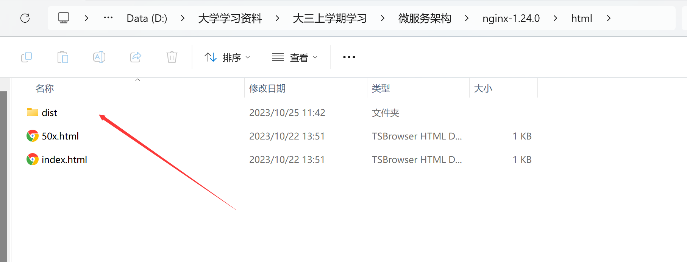
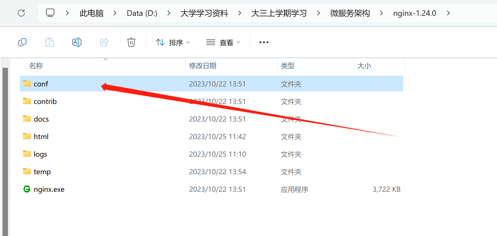
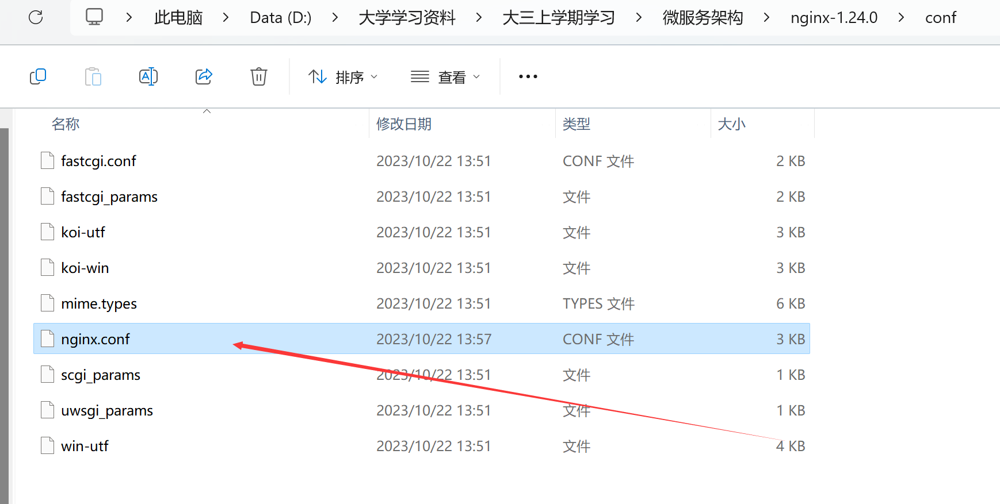

## Configuration and Deployment Description

### 前端部署（Windows 本机）

1. **准备前端环境**：
   - 在 Windows 本机安装 Node.js,npm,和Nginx。

2. **获取前端项目源代码**：
   - 您可以从项目的代码仓库克隆前端源代码。使用以下命令：
      ```
      git clone https://github.com/sssjmmm/Microservice-Architecture.git
      ```
      进入vue-project文件夹，或直接使用文档中的代码即可获得前端代码
3. **安装前端依赖项**：
   - 进入前端项目目录，并安装前端依赖项：
      ```
      cd vue-project\vue_project
      npm install
      ```

4. **构建前端应用**：
   - 使用以下命令构建前端应用：
      ```
      npm run build
      ```
   - 这将生成一个 `dist` 目录，包含已构建好的前端应用。

5. **dist文件复制**：
   - 将前端构建后的文件（位于 `dist` 目录中）部署到 Nginx 服务器中。配置 Nginx 以将前端请求代理到后端。
      
6. **Nginx部署**
   - 进入nginx.exe所在目录中的conf文件夹
      
   - 编辑nginx.conf文件
      
   - 将server配置成以下样式
      ```
      server {
            listen       80;
            server_name  100.80.163.115;//服务器的ip地址，此时暂时选择本机的公网地址

            location / {
                  root   html/dist; //增加一条dist子路径
                  index  index.html index.htm;
            }

            error_page   500 502 503 504  /50x.html;
            location = /50x.html {
                  root   html;
            }
         }
      ```
6. **上线使用**
   在nginx.exe所在目录下运行
   `./nginx`
   此时可以访问以下网址获取项目前端界面
   > http://100.80.163.115
    
### 后端部署（Ubuntu 虚拟机）

1. **服务器环境准备**：
   - 在 Ubuntu 虚拟机上，安装 Python 3.x 和 pip。您可以使用以下命令安装：
   ```
   sudo apt update
   sudo apt install python3 python3-pip
   ```

2. **获取后端代码**：
   - 您可以从项目的代码仓库克隆后端源代码。使用以下命令：
   ```
   git clone https://github.com/sssjmmm/Microservice-Architecture.git
   ```
   进入backend-projects文件夹，或直接使用文档中的代码即可获得后端代码
3. **安装后端依赖项**：
   - 进入后端项目目录,并安装后端依赖项：
   ```
   cd bysms
   pip install django==4.2.6
   pip install django-cors-headers==4.3.0
   pip install uwsgi
   ```

4. **数据库迁移**：
   - 运行数据库迁移命令以创建数据库表：
   ```
   python manage.py migrate
   ```

5. **修改`setting.py`**
   
   ```
   DEBUG = False

   ALLOWED_HOSTS = [ServerIP]
   ```

6. **启动 Django 应用**：
   - 使用 uWSGI 服务器来部署 Django 后端应用。
   1. 编写 uwsgi 文件
      在项目目录下，即manage.py的同级处创建uwsgi.ini
      ```
      [uwsgi]
      http=0.0.0.0:8888

      chdir=/home/sjm/bysms

      master=True

      processes=2

      buffer-size=65536

      vacuum=True
      daemonize=/home/sjm/run.log

      max-requests=5000

      wsgi-file=/home/sjm/bysms/bysms/wsgi.py
      ```
   2. 配置nginx文件监听uwsgi
      ```
      server {
         listen 80 ; #80是本地的端口
        
         server_name 100.80.67.59; #这里是你登录nginx的ip地址

         location /{
            include uwsgi_params;  #必须要写这行,
            uwsgi_pass 127.0.0.1:8000; #绑定为在uwsgi中的socket端口
         }

         location /static {
            alias /home/sjm/bysms/static #静态文件绑定为你的项目文件下的static文件
         }
      }
      ```
7. **启动服务**
   重启nginx服务
   ```
   sudo service nginx restart
   ```
   进入到你的项目目录，即编写的uwsgi.ini的位置 ，启动uwsgi
   ```
   sudo uwsgi uwsgi.ini
   ```
### 完成部署

通过完成上述步骤，前端 Vue3 项目和后端 Django 项目将成功部署（其中前端在Windows本机，后端在ubuntu虚拟机）。
当我启动nginx后您可以通过访问
http://100.80.163.115
从而获取前端界面
并在我启动linux虚拟机中的nginx和uwsgi后
您可以使用
http://100.80.67.59/api/mgr/citylog
从而获取后端sqlite数据库接口

---