# Application Design and Implementation Report

## Introduction
本项目旨在开发一个基于Vue3和Django的城市信息网站，使用户能够快速获取关于特定城市的各种信息，包括天气预报、城市油价、地理信息、文旅资讯、维基百科介绍以及空气质量数据。这个网站提供了一个全面的城市信息平台，帮助用户更好地了解他们感兴趣的城市。
### Background
在日常生活中，人们常常需要获取关于城市的各种信息，无论是为了旅行、生活决策还是满足好奇心。然而，这些信息通常分散在不同的网站和应用程序中，用户需要在多个平台之间切换来获取所需信息。这个项目的背景是为了创建一个单一的平台，以简化城市信息的访问。
### Goal
- 整合多个在线数据源，包括天气预报、油价、地理信息、维基百科、空气质量等，以提供全面的城市信息。
- 提供用户友好的界面，允许用户通过输入城市名称快速获取所需信息。
- 实现历史记录功能，以便用户可以查看他们之前查询的城市信息。
- 使用Vue3和Django构建前后端，以确保网站的性能和可扩展性。

---

## Application Overview

**Application Name:** [综合城市展板]

**Version:** [1.0]

**Development Person:**
- [SU JIAMING]
  
**Date of Report:** [2023/10/24]

## 技术选型
为了实现我的城市信息网站项目，我经过仔细考虑并选择了以下技术栈，以满足项目的需求和目标：

### 前端技术
- Vue3：我选择了Vue3作为前端框架，因为它提供了灵活性和性能，允许我构建交互式、响应式的用户界面。Vue3的Composition API使代码组织更加清晰和可维护。

- Axios：我使用Axios来进行网络请求，包括从各个在线数据源获取城市信息所需的数据。Axios提供了易于使用的方式来处理HTTP请求，并处理响应数据。

- Eslint：我选择Eslint作为代码风格统一的管理工具，使得前端代码变得规范。
### 后端技术
- Django：我选择了Django作为后端框架，因为它提供了强大的开发工具和安全性，同时具有优秀的文档和社区支持。

- SQLite：作为一个轻量级且易于部署的关系型数据库，SQLite非常适合我的项目，尤其是对于管理历史记录数据。

- Django REST framework：我使用Django REST framework来构建RESTful API，以便前端能够与后端进行数据交互。

- CORS 中间件：为了允许跨域请求，我使用Django的CORS中间件，以确保前端能够从不同来源获取数据。

### 部署和托管

- Nginx：作为反向代理服务器，Nginx将用于将前端和后端组件组合在一起，并提供更好的性能。

- uWSGI: 通过 WSGI 协议与 Python 应用程序通信。

- ubuntu虚拟机：我计划暂时将我的应用程序前端部署到本机，后端部署到ubuntu版本的linux虚拟机，以确保高可用性和扩展性。
---

## 实现细节

### 前端实现
#### 界面总览
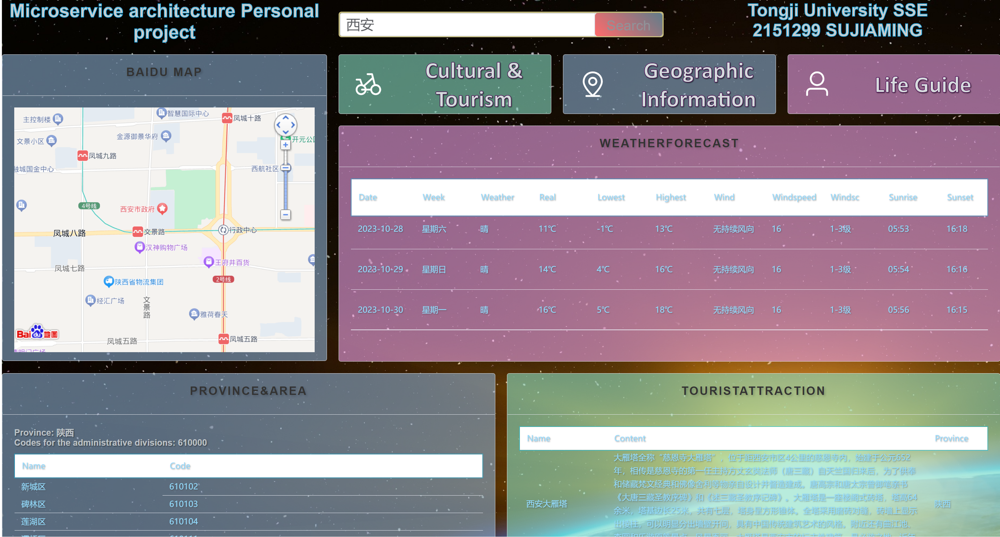
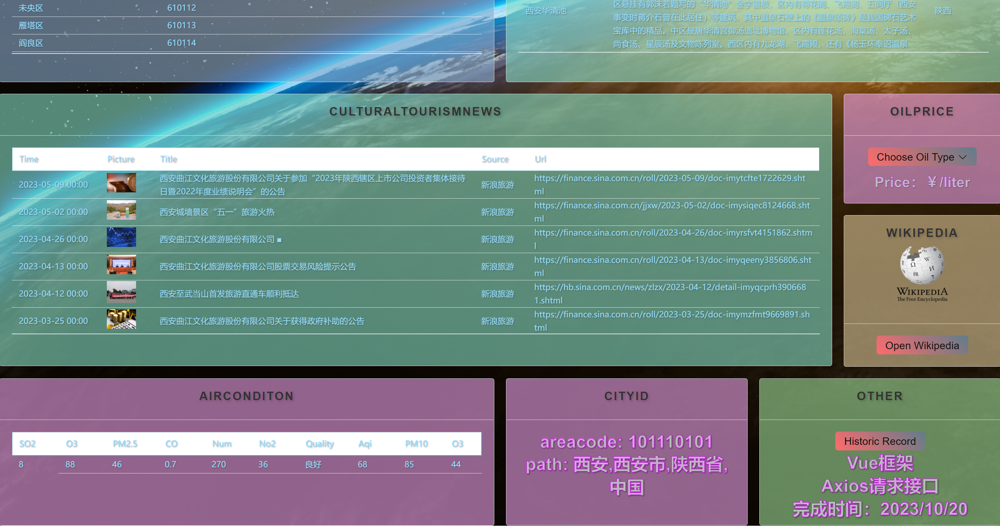
#### 1. 前端页面结构

我的前端页面结构包括以下主要部分：

- **城市名输入框**：用户输入城市名称并进行搜索的入口el-input组件。

- **文旅版块**：显示有关城市文化和旅游信息的部分。

1. 城市旅游景点：展示了该城市十个著名旅游景点的名称和简介，帮助用户更好地了解该地旅游信息。
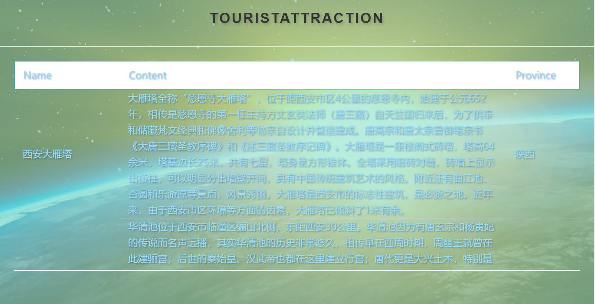
2. 文旅新闻：展示了该地文旅新闻的时间、标题、封面、来源以及url，让用户对文旅信息有更深入的认识。
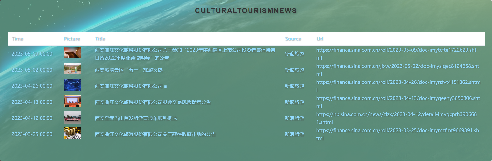

- **地理信息版块**：显示有关城市地理位置和地图的信息。

1. 百度地图：可进行地图的缩放以及定位，让用户对该城市的方位在总体上有更好的把握。
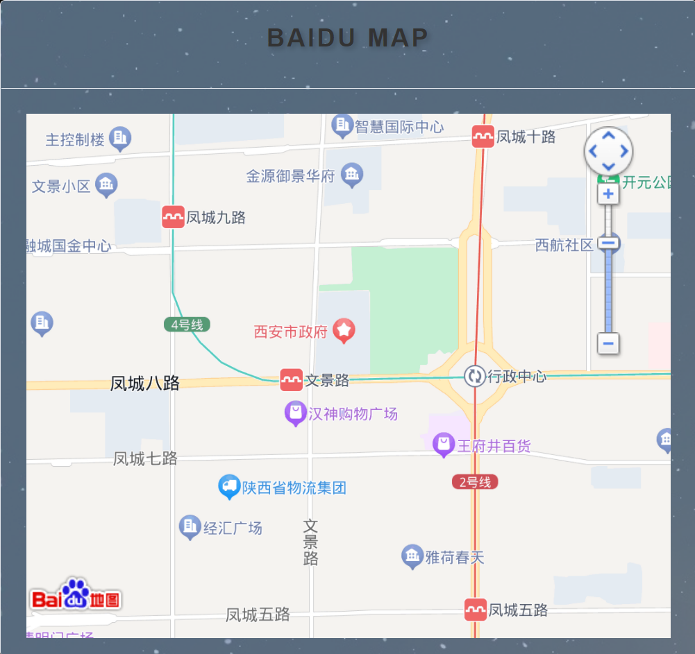
2. 省份以及各区信息：展示了该城市所在省份的信息以及该城的行政区编码，并且展示了该城下各个区的名称以及编码信息。
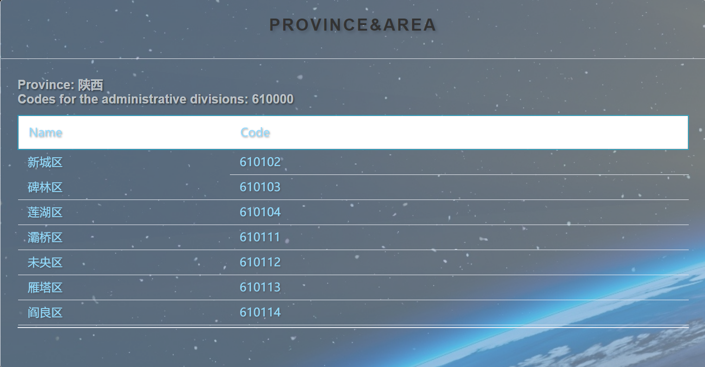
  
- **生活指南版块**：提供关于城市生活、油价和天气预报的部分。 

1. 城市油价：展示了该城市油价信息，包括0号柴油、89号汽油、92号汽油、95号汽油、98号汽油的油价信息。
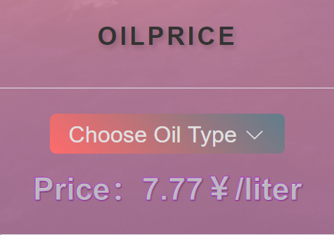
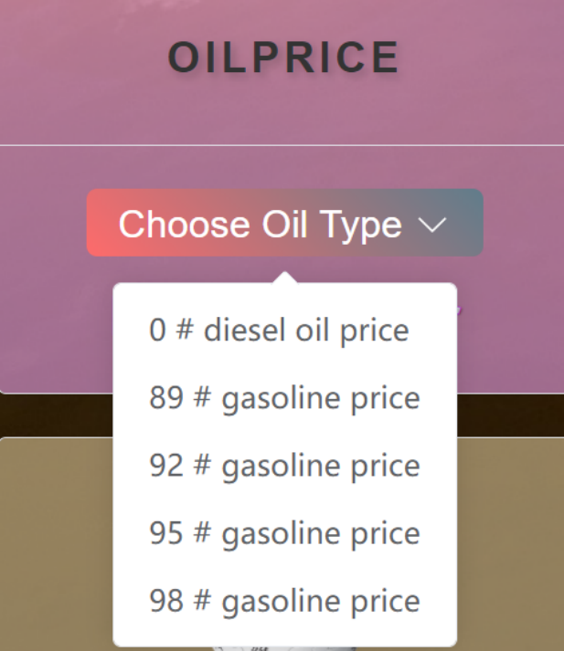
2. 空气质量：展示了该城市的空气质量信息，包括PM2.5,PM10等。
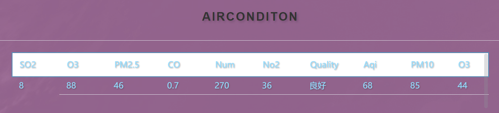
3. 城市ID及归属：展示了该城市的城市areacode及归属。
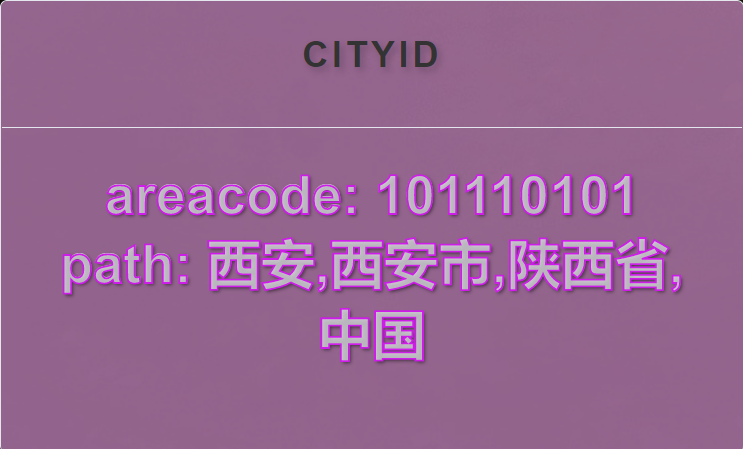
4. 天气预报：展示了该城市往后一周的天气预报信息，帮助用户出行无忧。
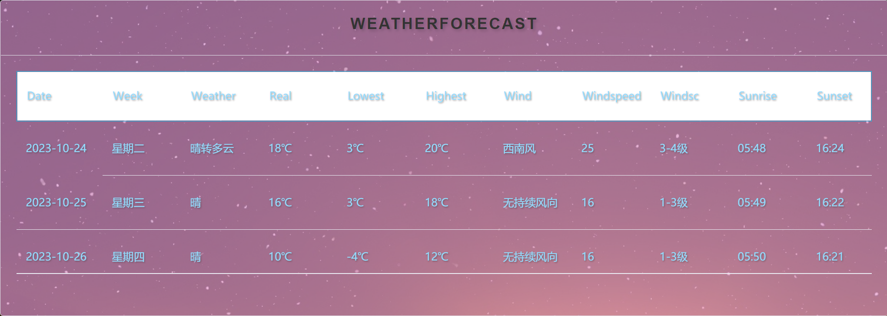
- **维基百科**：展示十条以该城市为关键词搜索后得到的百科信息，收藏在侧边抽屉中。
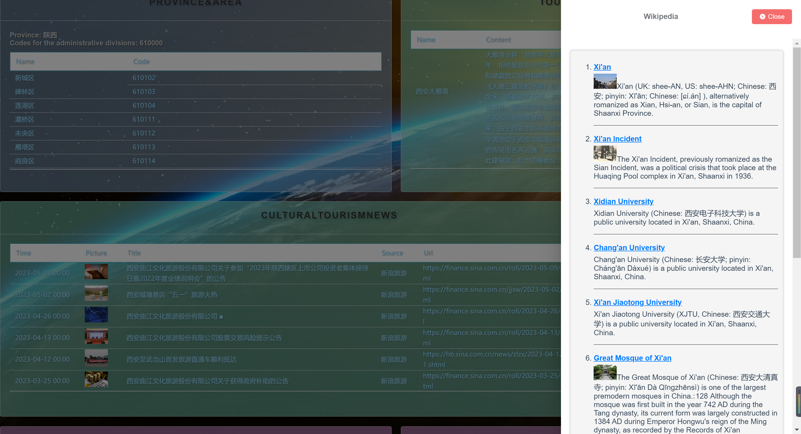
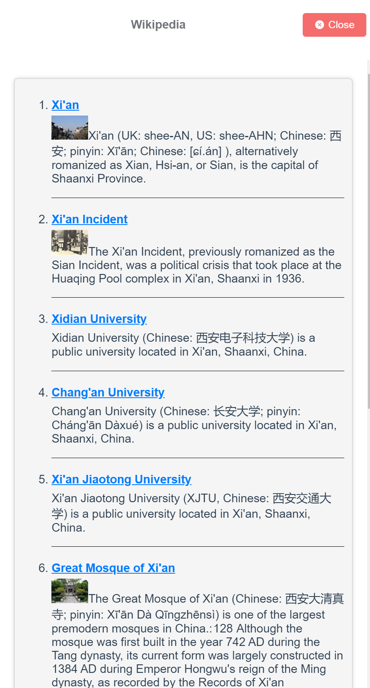
- **历史记录**：展示用户之前的查询记录，并提供刷新功能，收藏在侧边抽屉中。
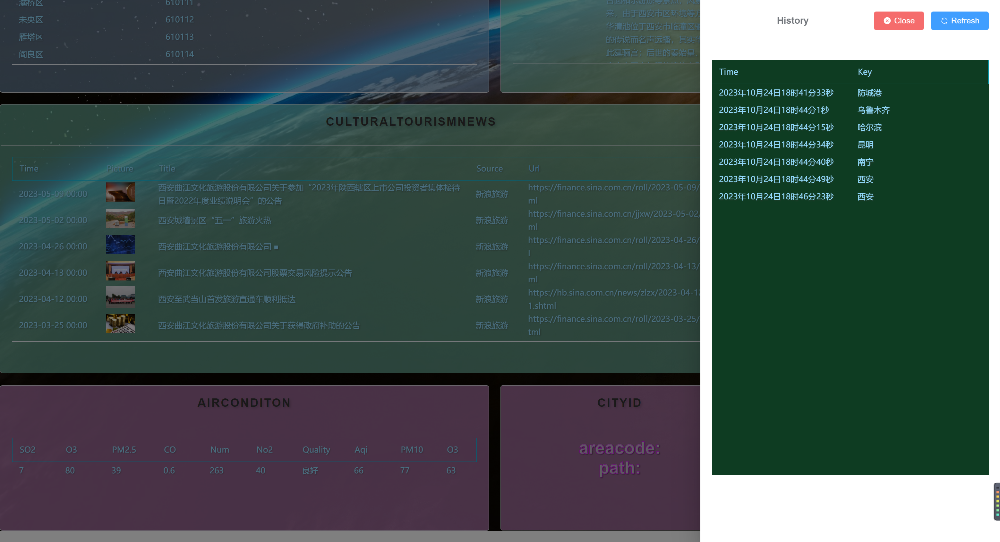
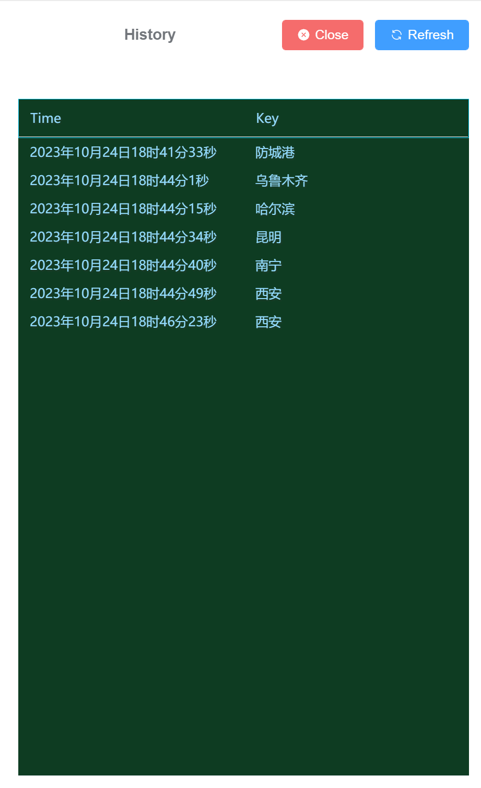
#### 2. Vue 组件

我使用了第三方组件库Element-plus来管理不同部分的界面：
- **el-input**：负责接收用户的城市查询输入，并触发相应的数据请求。
- **el-card**：用于管理每一个接口返回信息的展示，每个子部分分成独立的card从而能清晰明了地获取信息。
- **el-table**：展示接口返回的json格式的信息。
- **el-drawer**：展示维基百科和历史记录的信息。

#### 3. 数据请求和展示

- 使用Axios进行HTTP请求，调用后端的Django REST API来获取城市信息，包括空气质量、天气预报、油价等。
```
async getAirConditon() {
	try {
		await axios.get(`https://apis.tianapi.com/aqi/index?key=${this.API_KEY}&area=${this.city}`)
		.then((response) => {
			// 请求成功时的处理
			console.log(response.data.result)
			this.air_conditon.push(response.data.result)
			ElMessage({
				showClose: true,
				message: 'AirConditon: Congrats, request successfully.',
				type: 'success',
			})
		})
		.catch((error) => {
			// 请求失败时的处理
			console.error('Error:', error);
			ElMessage({
				showClose: true,
				message: 'AirConditon: Oops, request failed.',
				type: 'error',
			})
		});
	} catch (error) {
		this.error = error;
		ElMessage({
			showClose: true,
			message: 'AirConditon: Oops, request failed.',
			type: 'error',
		})
	}
},
```
- 用户输入城市名称后，数据将被请求并呈现在相应的组件中。
以下是按下搜索按钮后触发的searchCity函数,init函数的功能是请求所有接口，postHistory函数的功能是将搜索结果存入数据库
```
searchCity(){
	this.city = this.keyword;
	this.searchTerm = this.keyword;
	console.log(this.city);
	this.init();
	this.postHistory();
},
```
- 我使用JavaScript中的异步请求使不同接口的参数之间的前后关系能合理地安排。

通过异步请求以及合理的请求顺序，以及timeout函数，使得每个接口都能顺利地请求到数据。
```
async init(){
	await this.getProvinceArea(); //先加载接口5，获取省份
	console.log("调用接口5")
	console.log("调用接口6")
	await this.getCityAreacode(); //先加载接口8，获取areacode
	console.log("调用接口8")
	await this.getTouristAttraction();
	console.log("调用接口1")
	await this.getCulturalTourismNews();
	console.log("调用接口2")
	await this.getWeatherForecast();
	console.log("调用接口3")		
	await this.getOilPrice();//需要province
	console.log("调用接口6")
	await this.getAirConditon();
	console.log("调用接口7")
	await this.wikiSearch();
	console.log("调用接口9")
	await this.getHistory();
	console.log("调用接口10")
},
```
### 后端实现

#### 1. Django REST API

- 我创建了Django REST框架的API视图，以处理前端发来的请求。
- 使用Django模型来管理历史记录数据，包括城市名称、查询时间等。
- 利用Django ORM与SQLite数据库进行交互，存储历史记录数据。
  
不同操作对历史记录的分发函数
```
def dispatcher(request):
    # 将请求参数统一放入request 的 params 属性中，方便后续处理

    # GET请求 参数在url中，同过request 对象的 GET属性获取
    if request.method == 'GET':
        request.params = request.GET

    # POST/PUT/DELETE 请求 参数 从 request 对象的 body 属性中获取
    elif request.method in ['POST','PUT','DELETE']:
        # 根据接口，POST/PUT/DELETE 请求的消息体都是 json格式
        request.params = json.loads(request.body)


    # 根据不同的action分派给不同的函数进行处理
    action = request.params['action']
    if action == 'list_city':
        return listcities(request)
    elif action == 'add_city':
        return addcity(request)
    elif action == 'modify_city':
        return modifycity(request)
    elif action == 'del_city':
        return deletecity(request)

    else:
        return JsonResponse({'ret': 1, 'msg': '不支持该类型http请求'})
```
GET
```
def listcities(request):
    # 返回一个 QuerySet 对象 ，包含所有的表记录
    qs = Citylog.objects.values()

    # 将 QuerySet 对象 转化为 list 类型
    # 否则不能 被 转化为 JSON 字符串
    retlist = list(qs)

    return JsonResponse({'ret': 0, 'retlist': retlist})
```
POST
```
def addcity(request):

    info = request.params['data']

    # 从请求消息中 获取要添加客户的信息
    # 并且插入到数据库中
    # 返回值 就是对应插入记录的对象 
    record = Citylog.objects.create(key=info['key'] ,
                            time=info['time'])

    return JsonResponse({'ret': 0, 'id':record.id})
```
PUT
```
def modifycity(request):

    # 从请求消息中 获取修改客户的信息
    # 找到该客户，并且进行修改操作
    
    cityid = request.params['id']
    newdata = request.params['newdata']

    try:
        # 根据 id 从数据库中找到相应的客户记录
        city = Citylog.objects.get(id=cityid)
    except Citylog.DoesNotExist:
        return  {
                'ret': 1,
                'msg': f'id 为`{cityid}`的城市不存在'
        }


    if 'key' in  newdata:
        city.key = newdata['key']
    if 'time' in newdata:
        city.time = newdata['time']

    # 注意，一定要执行save才能将修改信息保存到数据库
    city.save()

    return JsonResponse({'ret': 0})
```
DELETE
```
def deletecity(request):

    cityname = request.params['key']

    try:
        # 根据 key 从数据库中找到相应的城市记录
        cityinfo = Citylog.objects.get(key=cityname)
    except Citylog.DoesNotExist:
        return  {
                'ret': 1,
                'msg': f'key 为`{cityname}`的城市不存在'
        }

    # delete 方法就将该记录从数据库中删除了
    cityinfo.delete()

    return JsonResponse({'ret': 0})
```
#### 2. 数据整合

- 我从在线网站获取了多个在线数据源的API，包括天气预报、百度地图、维基百科等，以获取城市信息的各个方面。
- 通过调用这些API，我获取数据，并在Vue的methods中进行处理。

#### 3. CORS 中间件

- 为了处理跨域请求，我配置了Django的CORS中间件，以确保前端能够安全地从不同来源获取数据。
**在后端解决：**
1. 安装django-cors-headers
```
pip install django-cors-headers
```
2. 注册运用：在项目的setting.py文件中
```
INSTALLED_APPS = (
	...
    'corsheaders',		# 加入应用描述
    ...
)
```
3. 添加中间件
MIDDLEWARE_CLASSES = (
    ...
    'corsheaders.middleware.CorsMiddleware',
    ...
)
4. 允许跨域ip:直接允许所有主机跨域
```
CORS_ORIGIN_ALLOW_ALL = True
```
5. 允许携带cookie
```
CORS_ALLOW_CREDENTIALS = True
```
6. 请求头和方法
```
CORS_ALLOW_METHODS = (
    'DELETE',
    'GET',
    'OPTIONS',
    'PATCH',
    'POST',
    'PUT',
    'VIEW',
)

CORS_ALLOW_HEADERS = (
    'XMLHttpRequest',
    'X_FILENAME',
    'accept-encoding',
    'authorization',
    'content-type',
    'dnt',
    'origin',
    'user-agent',
    'x-csrftoken',
    'x-requested-with',
    'Pragma',
)
```
### 历史记录功能

- 当用户进行城市查询时，查询记录将存储在SQLite数据库中，包括城市名称和查询时间。
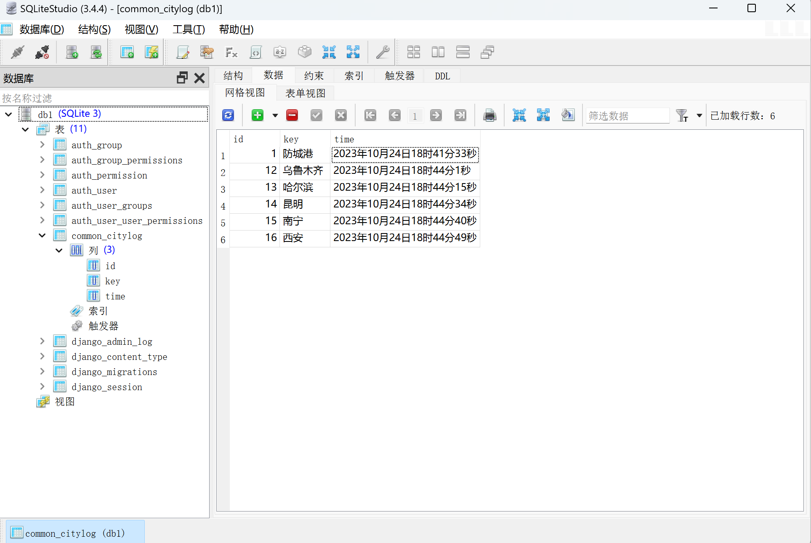
- 用户可以在历史记录页面查看之前的查询，并点击以重新加载相关城市信息。

---

## 挑战与解决方案

### 1. 数据整合和多个API的复杂性

**挑战**：整合来自不同数据源的信息，包括天气预报、油价、地理信息和维基百科，可能会导致数据格式不一致、频率限制和错误处理的问题。

**解决方案**：
- 为不同数据源编写专用的数据处理代码，以确保数据格式一致。
- 实施错误处理机制，包括错误消息提示和数据降级策略，以提高用户体验。
展示不同类型的油价
```
showOilPrice(command) {
	switch (command){
		case "t0":
			this.oil_price_key = this.oil_price.t0;
			break;
		case "t89":
			this.oil_price_key = this.oil_price.t89;
			break;
		case "t92":
			this.oil_price_key = this.oil_price.t92;
			break;			
		case "t95":
			this.oil_price_key = this.oil_price.t95;
			break;
		case "t98":
			this.oil_price_key = this.oil_price.t98;
			break;
		default:
			break;		
	}
},
```
省份格式转化的函数
```
changeProviceKey(old_province){
	//目标格式：
	//安徽、北京、重庆、福建、甘肃、广东、广西、贵州、海南、
	//河北、黑龙江、河南、湖北、湖南、江苏、江西、吉林、辽宁、
	//内蒙古、宁夏、青海、陕西、上海、山东、山西、四川、天津、西藏、新疆、云南、浙江
			
	//需要转化的省份：
	//广西壮族自治区 内蒙古自治区 黑龙江省 宁夏回族自治区 西藏自治区 新疆维吾尔自治区
	if(old_province == '内蒙古自治区' || old_province == '黑龙江省'){
		this.province = old_province.substr(0,3);
	}
	else{
		this.province = old_province.substr(0,2);
	}

},
```
错误输入提示
```
ElMessage({
	showClose: true,
	message: 'CityAreacode: Oops, request failed. Please enter the correct city name.eg.\"上海\",instead of \"上海市\" ',
	type: 'error',
	duration: 5000
})
```
### 2. 跨域请求和前后端协作

**挑战**：前端和后端需要协同工作，同时前端必须处理跨域请求。

**解决方案**：
- 配置Django的CORS中间件以允许跨域请求。
- 使用RESTful API来定义前后端之间的数据交换协议，以确保数据的一致性和可理解性。

### 3. 数据库管理和历史记录功能

**挑战**：管理SQLite数据库以存储用户查询的历史记录可能会导致数据库维护和性能问题。

**解决方案**：
- 使用Django ORM（对象关系映射）来管理数据库，以减少手动数据库操作的工作量。
- 定期清理和归档历史记录，以确保数据库性能。
- 实现适当的索引以提高历史记录的查询性能。

### 4. 用户体验和性能优化

**挑战**：确保用户界面友好、响应迅速以及不会出现加载延迟是一个重要挑战。

**解决方案**：
- 使用Vue3的虚拟DOM和异步渲染来提高前端性能。
- 最小化前端和后端的HTTP请求以减少加载时间。

---

## 项目成果

### 1. 城市信息网站

我成功地开发了一个功能齐全的城市信息网站，为用户提供了方便的途径来获取关于各个城市的多种信息。用户可以输入城市名称，然后访问以下信息：

- **天气预报**：我从在线API获取实时的天气信息，包括温度、湿度、风速等。
- **城市油价**：提供了所在城市的油价信息，帮助用户计划其旅行成本。
- **地理信息**：显示城市的地理位置，并提供与百度地图的链接。
- **文旅资讯**：整合了城市的文化和旅游信息。
- **生活指南**：提供关于城市生活、交通和实用信息。
- **维基百科**：提供关于城市的多方面信息及连接跳转。

### 2. 用户友好的界面

我的项目提供了清晰、直观的用户界面，用户可以轻松地输入城市名称并快速获取所需信息。前端采用了响应式设计，以确保在各种设备上都能提供出色的用户体验。

### 3. 历史记录功能

我成功实现了历史记录功能，允许用户查看其之前的查询。这提供了方便的方式来跟踪之前的城市信息。

### 4. 数据整合和更新

项目整合了多个在线数据源，包括天气API、百度地图、维基百科等，以提供全面的城市信息。

### 5. 安全性和性能

我部分url采用了HTTPS来确保数据传输的安全性，并实施了数据验证和过滤来保护用户数据。项目的性能得到了优化，以确保快速加载和响应。

### 6. 用户反馈

用户的反馈非常积极，他们表扬了网站的易用性和信息的全面性。用户感到这个项目为他们提供了一个有用的城市信息资源，使他们更好地了解和计划他们的旅行和生活。


---

## 结论

本项目旨在开发一个基于Vue3和Django的城市信息网站，提供用户一个方便的方式来获取有关各个城市的多种信息，包括天气预报、城市油价、地理信息、文旅资讯和生活指南。通过项目的成功实施，我得出了以下结论：

### 成就和成功

- 我成功实现了一个全面的城市信息网站，用户可以方便地查询各种信息，无论是为了旅行、生活决策还是满足好奇心。
- 项目采用了前端技术Vue3和后端技术Django的组合，以确保性能和可扩展性。
- 我实现了历史记录功能，为用户提供了查看之前查询的城市信息的便捷方式。

### 用户反馈和接受度

- 用户反馈非常积极，他们感到网站易用、信息全面，并对其实用性表示赞扬。
- 这个项目为用户提供了一个有用的城市信息资源，使他们更好地了解和计划他们的旅行和生活。

### 未来展望

作为项目的未来发展，我计划进一步改进和扩展功能，以满足更广泛的用户需求：

- 增加更多的城市信息和数据源，以提供更多的信息和多样性。
- 实现用户账户管理，以提供个性化的功能和历史记录的保存。
- 进一步优化性能和安全性，以确保网站的可用性和用户数据的保护。
- 探索移动应用的开发，以提供更多的移动端用户体验。

综上所述，这个项目代表了一个成功的尝试，通过技术和创新，为用户提供了一个方便的城市信息资源。我期待未来的发展，以继续改进和拓展这个项目，为更多的用户提供价值。

---

## 致谢

在完成这个项目的过程中，有许多人和组织对项目的成功实施提供了宝贵的支持和帮助。我要衷心感谢以下人员和团队：

### 1. 指导老师

感谢我的指导老师刘岩，为我提供了在项目开发前知识的补充。老师的知识和经验对项目的成功至关重要。

### 2. 开源社区

感谢开源社区为我提供了丰富的工具、框架和资源，使项目开发变得更加高效和便捷。开源精神激励了我在开发中积极贡献和学习。

### 3. 室友

感谢我的室友，他们在项目中提供了宝贵的建议和反馈，帮助我克服了一些挑战。他们的支持对项目的成功有着重要的影响。

### 4. 用户反馈

最重要的是，感谢所有使用并提供反馈的用户。他们的反馈和建议帮助我不断改进项目，确保它满足用户需求。

---

## 参考

###  Documents of the Web APIs

1. 维基百科接口请求的实现
> https://www.cnblogs.com/zczhangcui/p/6251604.html

2. 百度地图接口请求的实现
> https://map.heifahaizei.com/doc/baidu-map.html

3. 天气预报和CityAreacode
> https://www.apispace.com/eolink/api/456456/apiDocument

4. 空气质量
> https://www.tianapi.com/apiview/178

5. 文旅新闻
> https://www.tianapi.com/apiview/15

6. 旅游景区
> https://www.tianapi.com/apiview/93

7. 今日油价
> https://www.mxnzp.com/doc/detail?id=34

8. 全国城市信息
> https://www.mxnzp.com/doc/detail?id=8

### 其他参考网站
- django模板的使用
> https://www.byhy.net/tut/webdev/django/

- 解决跨域问题
> https://blog.csdn.net/qq_41866851/article/details/118528460

- 后端部署
> https://zhuanlan.zhihu.com/p/549354781
   